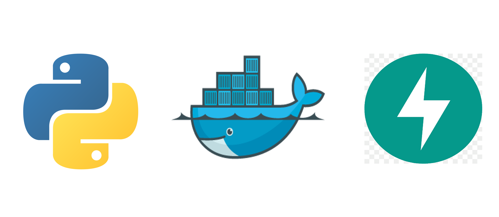
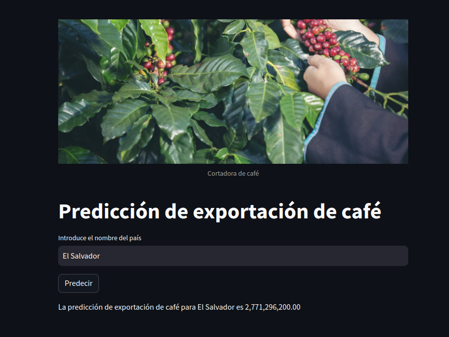

<h1 align="center">CafeDataHub</h1>

  

Este proyecto surge de mi profundo interés por comprender mejor la industria del café y mi pasión por explorar sus diversas facetas. El objetivo principal es proporcionar una visión detallada y completa de la industria del café a nivel mundial. Esto permitirá a los interesados en el campo del café y la agricultura comprender mejor el panorama actual de esta industria y tomar decisiones informadas basadas en datos sólidos y análisis exhaustivos.Cabe destacar que los datos usados los descargue de  [KAGGLE](https://www.kaggle.com/)

En este proyecto, se llevó a cabo un análisis de los principales productores, importadores, exportadores y consumidores de café a nivel mundial. Para comprender mejor la dinámica de la industria del café, se realizó un Análisis Exploratorio de Datos (EDA), donde se examinaron detalladamente diversas variables y tendencias relevantes.

Además del EDA general, se incluyó un análisis específico de El Salvador, donde se exploraron detalladamente las exportaciones de café a lo largo del tiempo y el consumo interno de café. Estas visualizaciones proporcionaron una perspectiva única sobre la contribución de El Salvador a la industria del café y su consumo interno a lo largo de los años.

Además de los modelos de Machine Learning y el análisis específico de El Salvador, se desarrollaron dos modelos de Machine Learning para predecir las exportaciones de café para cualquier país cafetalero. Se implementaron modelos de Regresión Lineal y Random Forest, y se descubrió que el modelo Random Forest demostró ser más efectivo en las predicciones. Utilizando este modelo, se logró una precisión significativa en las estimaciones de las exportaciones de café, brindando una valiosa herramienta para la planificación y la toma de decisiones en la industria cafetalera.

Además de los modelos de Machine Learning y la API, se creó un sitio web interactivo utilizando Streamlit, donde los usuarios pueden verificar y validar las predicciones de exportación de café. Esta plataforma proporciona una forma fácil y accesible para que los usuarios exploren las predicciones y comprendan mejor los datos relacionados con la industria del café.

  

A lo largo del proyecto, se generaron visualizaciones gráficas claras y concisas que ofrecen una perspectiva visual de los países líderes en cada categoría, así como patrones y relaciones importantes dentro de la industria del café. Este análisis integral, combinado con la plataforma interactiva y las herramientas de Machine Learning, proporciona información valiosa para los actores clave en la industria, desde productores hasta consumidores, facilitando una toma de decisiones más informada y estratégica.
 
[Web para probar el Modelo](https://cafedataml.streamlit.app/)

  

 

